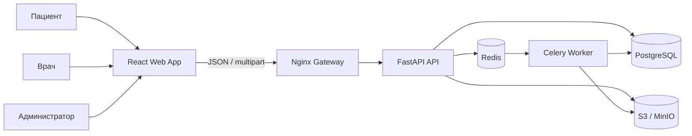
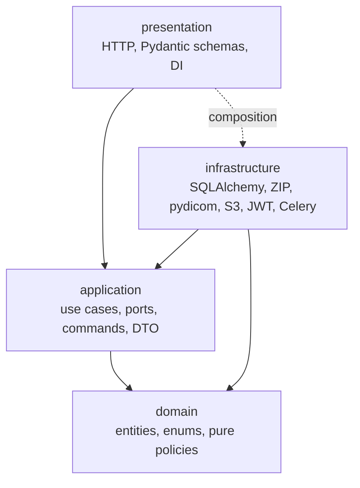
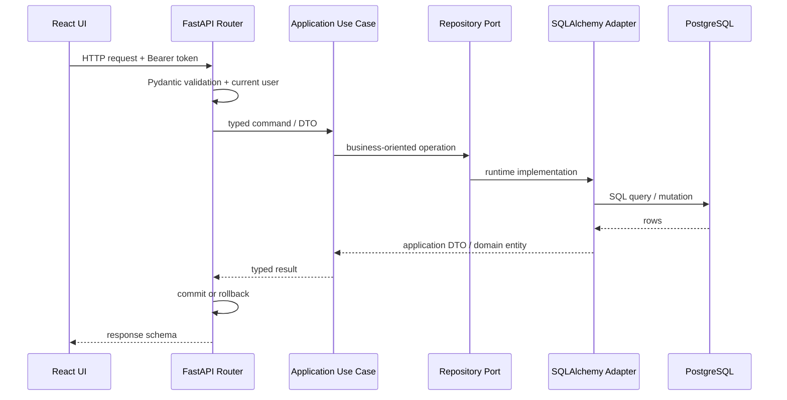
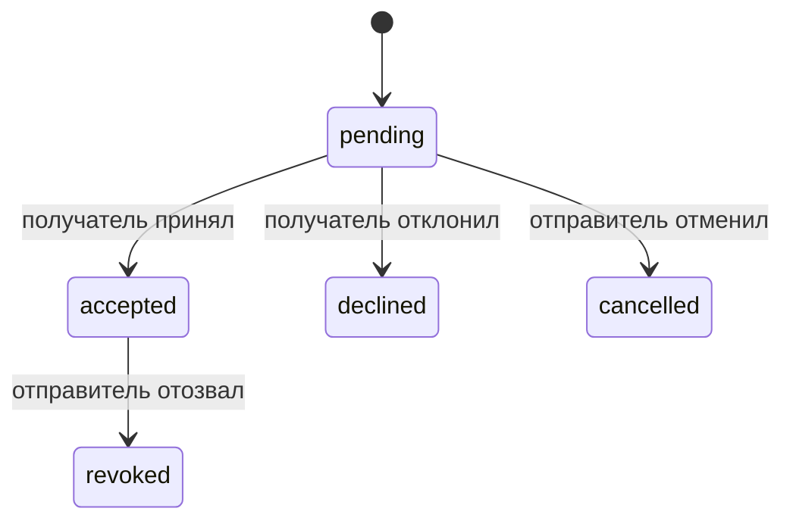
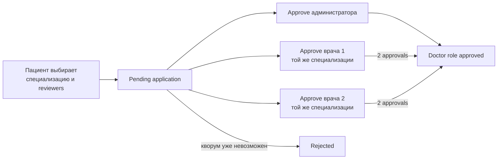
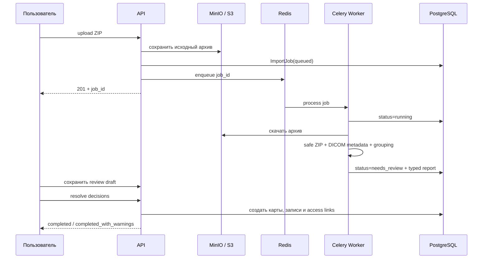

# Архитектура Docere

Этот документ описывает техническое устройство Docere: границы модулей, направление зависимостей, модель доступа к медицинским данным, фоновые процессы, безопасность и эксплуатационные решения.

Продуктовые сценарии и демонстрационный запуск находятся в [README.md](README.md). Правила внесения изменений - в [CONTRIBUTING.md](CONTRIBUTING.md).

## 1. Архитектурные цели

Docere работает с данными, для которых особенно важны происхождение, доступ и объяснимость изменений. Архитектура строится вокруг пяти целей:

1. **Бизнес-правила не зависят от фреймворка.** Решение о подтверждении роли врача или возможности создать запись не должно быть спрятано в FastAPI router либо SQLAlchemy model.
2. **Доступ имеет происхождение.** Недостаточно знать, что пользователь видит запись; важно понимать, почему он её видит и какое действие должно отозвать это право.
3. **Импорт является review workflow.** Эвристика может предложить решение, но не должна незаметно изменить медицинскую историю.
4. **Инфраструктура заменяема через порты.** ZIP, DICOM, PostgreSQL, S3, JWT и очередь подключаются как adapters.
5. **Ограничения проверяются автоматически.** Направление зависимостей зафиксировано не только договорённостью, но и архитектурными тестами.

## 2. Контекст системы



API остаётся stateless относительно пользовательской сессии: клиент передаёт JWT, а актуальный статус и роль пользователя загружаются из БД. Большие бинарные объекты не хранятся в PostgreSQL: БД содержит метаданные и storage key, содержимое лежит в S3-compatible storage.

## 3. Слои и правило зависимостей

Backend следует DDD + Clean Architecture с dependency inversion.



Правила:

- `domain` не импортирует внешние слои;
- `application` зависит только от `domain` и собственных ports/DTO;
- `infrastructure` реализует application ports;
- `presentation` преобразует транспортный контракт в command/DTO, вызывает use case и формирует HTTP response;
- ORM-запросы и SQLAlchemy rows должны оставаться внутри infrastructure adapters;
- Pydantic request/response schemas не используются как доменные модели.

Архитектурный тест разбирает Python AST и запрещает application импортировать `app.infrastructure`, `app.presentation`, `zipfile`, `pydicom`, `mimetypes` и `BytesIO`. Это защищает границу от постепенного возврата инфраструктурных деталей в use cases.

В текущем коде есть одна зафиксированная пограничная задолженность: поиск получателей sharing выполняет SQLAlchemy query непосредственно в presentation router. Основные command flows проходят через ports, а этот query должен быть вынесен в `ShareRequestRepositoryPort`. Ограничение указано явно, чтобы архитектурный документ оставался проверяемым описанием системы, а не декларацией желаемого состояния.

## 4. Структура backend

```text
src/app/
├── domain/
│   └── entities/                 # доменные модели, статусы и pure policies
├── application/
│   ├── ports/                    # Protocol-интерфейсы и DTO границ
│   └── use_cases/                # оркестрация бизнес-сценариев
├── infrastructure/
│   ├── adapters/                 # реализации ports
│   │   ├── import_jobs/          # ZIP, pydicom, сериализация report
│   │   ├── queue/                # Celery и восстановление jobs
│   │   ├── repositories/         # SQLAlchemy repositories
│   │   ├── security/             # JWT и PBKDF2
│   │   └── storage/              # S3-compatible storage
│   ├── config/                   # Pydantic Settings
│   └── db/                       # engine, sessions, ORM rows, seed
└── presentation/
    ├── rest/                     # routers и transport schemas
    ├── webserver/                # middleware, errors, lifecycle
    └── cli.py                    # management commands
```

Сценарии организованы по бизнес-возможностям: `medical_records`, `patients`, `share_requests`, `import_jobs`, `doctor_role_applications`, `auth`, `audit_events`, `admin_dashboard`.

## 5. Обычный HTTP-поток



FastAPI dependencies являются composition root: они создают adapter на текущей SQLAlchemy session и передают его в use case. Роутер отвечает за HTTP-коды, Pydantic и транзакционный commit/rollback; use case отвечает за смысл операции.

## 6. Доменная модель

### 6.1 Пациент и учётная запись

`PatientPassport` представляет медицинскую карточку человека и не обязан иметь `patient_user_id`. Это позволяет врачу завести черновую карту пациента, который ещё не зарегистрирован.

Статусы паспорта:

- `draft` - локальная карточка, созданная сотрудником;
- `confirmed` - карточка связана с подтверждённым пациентом.

Такое разделение не смешивает identity пользователя с медицинским субъектом. Один из важных эффектов: медицинская история может существовать до регистрации пациента.

### 6.2 Врач

`PractitionerPassport` хранит профессиональный контекст автора: специализацию, организацию, должность и контакты. Медицинская запись ссылается на паспорт врача, поэтому отображаемый автор не растворяется в произвольной строке.

Изменение ФИО и специализации подтверждённого врача разрешено как обычная операция профиля. Adapter синхронизирует `UserRow` и связанный `PractitionerPassportRow`, а presentation сохраняет audit event с `before`/`after` для каждого изменённого поля.

### 6.3 Медицинская запись

`MedicalRecord` содержит:

- тип: консультация, обследование, лабораторный результат или другое;
- `event_date` - дата медицинского события, обязательная и отдельная от `created_at`;
- врача-автора;
- статус `unconfirmed` / `confirmed`;
- структурируемый `payload_json` для специфичных полей;
- клиническое резюме, место события, вложения и комментарии;
- `confirmed_by_user_id` и `confirmed_at` для provenance подтверждения.

Use case проверяет роль, доступ к пациенту и существование паспорта автора до создания записи. Пациент может создавать запись только в собственной карте; врач или администратор - только в доступной карте.

## 7. Модель доступа: право с происхождением

Центральная таблица авторизации медицинских записей - `user_record_links`.

```text
UserRecordLink
├── user_id
├── record_id
├── patient_passport_id
├── source
├── source_record_share_id
└── expires_at
```

Поддерживаемые источники:

| Source | Значение |
|---|---|
| `creator` | пользователь создал запись |
| `share_accepted` | получатель принял sharing-запрос |
| `imported` | зарезервированный источник для отдельного import provenance link |
| `manual_attach` | зарезервированный источник для явного прикрепления записи |

Это не просто ACL. Поля `source_record_share_id` и `expires_at` позволяют:

- удалить ровно то право, которое породил конкретный share;
- не затронуть доступ из другого источника;
- скрыть истёкшее право без удаления истории запроса;
- объяснить, почему запись попала в карточку пользователя.

Текущий resolve импорта создаёт запись от имени импортирующего пользователя с `creator` link, а происхождение содержимого фиксируется в import report и `payload_json.import_source`. Выделенный `imported` link оставлен в enum для будущего сценария, где импорт не должен приравниваться к авторству.

Проверки доступа находятся в repository adapters как повторно используемые запросы, но решение о допустимости операции остаётся в use case.

## 8. Sharing и каскадный отзыв

### 8.1 Две сущности вместо одной

`RecordShareRequest` хранит отправителя, получателя, сообщение, срок и общий статус. `RecordShare` связывает запрос с каждой отдельной медицинской записью. Поэтому один запрос может содержать несколько записей, а каждая запись сохраняет собственный статус.



Принятие создаёт `UserRecordLink(source=share_accepted)`. Отклонение и отмена не создают фактического доступа. Срок хранится и на запросе, и на access link, чтобы read path мог исключить истёкшее право.

### 8.2 Алгоритм каскадного отзыва

Пример цепочки:

```text
A --share--> B --reshare--> C --reshare--> D
```

При отзыве A -> B выполняется:

1. удаляется link B, созданный конкретным `RecordShare`;
2. после `flush` проверяется, осталось ли у B другое активное право на запись;
3. если право осталось, каскад останавливается;
4. если право потеряно, исходящие `pending` и `accepted` shares B по этой записи переводятся в `revoked`;
5. links их получателей удаляются тем же точечным способом;
6. обход продолжается рекурсивно с защитой от повторного посещения;
7. дочерний request становится `revoked`, только если в нём не осталось активных записей.

Это сохраняет важный инвариант: отзыв ветки происхождения не должен уничтожать независимое легитимное право.

## 9. Получение роли врача

Заявка на роль врача моделируется отдельно от пользователя и содержит набор назначенных review.



Pure function `evaluate_doctor_role_application` не знает о БД или HTTP. Она вычисляет итог:

- одного одобрения администратора достаточно;
- без администратора нужны два разных одобрения врачей заявленной специализации;
- заявка отклоняется, когда среди оставшихся review уже невозможно собрать кворум;
- повторное решение и изменение финальной заявки запрещены.

Пациент сам выбирает проверяющих, но use case сверяет их с repository-списком eligible reviewers и не позволяет сформировать набор, который изначально не способен дать кворум.

## 10. Импорт архивов

### 10.1 Почему это job, а не один HTTP request

Архив может быть большим, содержать DICOM и требовать анализа сотен файлов. API быстро сохраняет исходный ZIP в object storage, создаёт `ImportJob` и отправляет его в Redis. Celery worker выполняет CPU/IO работу независимо от жизненного цикла HTTP-запроса.



### 10.2 Порты и adapters

| Application port | Infrastructure adapter | Ответственность |
|---|---|---|
| `ArchiveReaderPort` | `ZipArchiveReader` | безопасное чтение ZIP и нормализация путей |
| `DicomMetadataReaderPort` | `PydicomMetadataReader` | чтение только необходимых DICOM tags без pixel data |
| `PatientMatcherPort` | `RepositoryPatientMatcher` | поиск доступных существующих карт |
| `FileStoragePort` | `S3FileStorageAdapter` | хранение архивов и вложений |
| `ImportJobRepositoryPort` | SQLAlchemy adapter | статусы job, report и review draft |

`ExtractImportDraftUseCase` получает bytes и typed command, но не импортирует `ZipFile`, `BytesIO`, `mimetypes` или `pydicom`. Его задача - оркестрация кандидатов, а не parsing конкретного формата.

### 10.3 Безопасность ZIP

`ZipArchiveReader` применяет конфигурируемые лимиты:

- максимальное число файлов;
- максимальный размер одного распакованного файла;
- максимальный суммарный распакованный размер;
- максимальный compression ratio.

До нормализации отклоняются:

- абсолютные Unix paths;
- Windows drive paths вида `C:/...`;
- сегменты `..` и `.`;
- `__MACOSX`, `.DS_Store`, AppleDouble и другой системный мусор;
- пустые и подозрительно сжатые файлы.

Подозрительный entry не обрушает весь best-effort анализ: он пропускается, а warning попадает в review. `BadZipFile` и `LargeZipFile` преобразуются в application error и далее в понятный job report.

### 10.4 Семантика дат

Дата рождения имеет более строгий источник доверия, чем дата события.

Приоритет `patient_birth_date`:

1. DICOM `PatientBirthDate`;
2. явно размеченный контекст: `dob`, `birth`, `date_of_birth`, `дата рождения`, `др`, `рожд`;
3. иначе значение остаётся пустым.

Произвольная дата в имени архива или папки никогда автоматически не становится датой рождения.

Для `event_date` используются DICOM `StudyDate`, `SeriesDate`, `ContentDate` и даты в пути. Если кандидатов несколько, автоматическое значение остаётся пустым, warning сохраняет варианты, а UI требует явного выбора. Resolve запрещает импорт выбранной группы без даты события.

### 10.5 Группировка DICOM

Файлы объединяются в медицинскую запись по следующему приоритету:

1. `StudyInstanceUID`;
2. `SeriesInstanceUID`;
3. fallback по папке, дате и modality.

`pydicom.dcmread` вызывается только в infrastructure adapter с `stop_before_pixels=True` и ограниченным `specific_tags`. Для построения review не требуется загружать pixel data исследования.

### 10.6 Resolve и дубликаты

Разбор архива ничего не создаёт в медицинской карте. На стадии resolve пользователь выбирает существующую карту или создание новой, группы для импорта, тип и дату.

Потенциальный дубликат требует совпадения доступной пользователю карты пациента, типа, даты события и нормализованного названия. Само совпадение не блокирует review, но resolve требует явного `allow_possible_duplicate`. Такое разрешение сохраняется в итоговом report и отдельном audit event.

`report_json` новых заданий содержит `schema_version`. После resolve поле `resolved_patients` связывает каждый исходный `candidate_id` с итоговым `patient_id`, созданными `record_ids` и решением по каждой группе. Старые отчёты без версии остаются читаемыми через optional поля публичной схемы.

## 11. Транзакции и согласованность

SQLAlchemy session создаётся на HTTP request с `autoflush=False`, `autocommit=False`, `expire_on_commit=False`.

Основные правила:

- repository не коммитит скрытно внутри каждой операции;
- presentation управляет commit/rollback после завершения use case;
- сложные сценарии могут выполнить несколько repository-вызовов в одной транзакции;
- явный `flush` используется там, где следующая проверка должна увидеть удалённые или созданные rows в той же транзакции;
- unique indexes защищают от нескольких конфликтующих access links для одной пары пользователь/запись/карта;
- server defaults используются для timestamps, чтобы источником времени записи оставалась БД.

Миграции выполняются Alembic отдельным deployment step. Рекомендуемая стратегия для несовместимых изменений - expand, backfill, переключение кода, contract.

## 12. Контракты API

У каждого уровня свой тип данных:

```text
HTTP JSON
  -> Pydantic Request Schema
  -> Application Command / DTO
  -> Domain Entity or Port DTO
  -> Pydantic Response Schema
  -> HTTP JSON
```

Например, import `report_json` физически хранится в PostgreSQL как JSON, но на API-границе валидируется отдельными вложенными Pydantic schemas. Это позволяет сохранить гибкость хранения, не превращая публичный контракт в `dict[str, object]`.

Transport errors унифицированы глобальными handlers. Неожиданное исключение логируется на сервере, а клиент получает нейтральное `Internal server error` без stack trace и внутренних деталей.

## 13. Аутентификация, авторизация и аудит

### Аутентификация

- access и refresh JWT имеют разные `type` claims и TTL;
- пользователь загружается из БД после декодирования токена;
- заблокированный пользователь не получает действующий application context;
- пароли хешируются PBKDF2-HMAC-SHA256 с индивидуальной случайной солью и 600 000 итераций;
- сравнение digest выполняется через `hmac.compare_digest`;
- login защищён rate limit на endpoint/email.

Текущий rate limiter in-memory подходит для локального single-instance режима. Для горизонтального production deployment его следует перенести в Redis, чтобы лимит был общим для всех API replicas.

### Авторизация

RBAC отвечает на вопрос «может ли роль выполнять такой тип действия», а record-level access - «имеет ли этот пользователь отношение к конкретной записи». Оба условия проверяются до mutation.

### Аудит

Audit event содержит actor, тип события, тип и ID сущности, timestamp и структурированные metadata. Индексы поддерживают выборки по времени, actor и entity. В аудит попадают действия, которые меняют доверие или доступ, включая изменения профиля врача и override потенциального дубликата.

## 14. Асинхронность и восстановление

Import worker использует soft/hard time limits. Job сначала переводится в `running`, а финальный report и status сохраняются одной worker-транзакцией.

При старте worker выполняется recovery pass: задания в `queued` или `running`, оставшиеся без живой Celery-задачи после рестарта, повторно ставятся в очередь. Финальные jobs не переотправляются.

Идемпотентность resolve обеспечивается на уровне статуса job: повторный resolve финального задания возвращает уже сформированный результат вместо повторного создания записей.

Текущий broker publishing настроен без publish retry, поэтому recovery pass является важной частью локальной надёжности. Для распределённого production-контура следующим шагом может стать transactional outbox.

## 15. Файлы и object storage

`FileStoragePort` отделяет use cases от S3 SDK. В локальном окружении adapter работает с MinIO, в deployment может использовать любой S3-compatible endpoint.

В PostgreSQL сохраняются:

- storage key;
- MIME type;
- размер;
- категория вложения;
- связь с записью или комментарием;
- пользователь, загрузивший файл.

Скачивание проходит через авторизованный use case: знание storage key само по себе не является правом доступа.

## 16. Наблюдаемость

Каждый HTTP request получает `X-Request-ID` или продолжает переданный клиентом идентификатор. Structured log `http_request` содержит method, path, status и duration.

Импорт пишет отдельные события:

- `import_job_processing_started`;
- `import_job_processing_finished`;
- `import_job_processing_failed`.

Поля включают `job_id`, размер архива, число файлов, число warnings, duration и итоговый status. Nginx дополнительно логирует upstream address, upstream status и latency.

Health endpoints существуют на уровне Nginx и FastAPI. API container имеет Docker healthcheck. Graceful shutdown сначала переводит процесс в draining, временно отвечает новым запросам `503 Connection: close`, затем закрывает SQLAlchemy engine.

## 17. Deployment topology

Локальный compose поднимает:

```text
browser -> :8000 gateway Nginx -> frontend Nginx
                               -> api:8000 -> PostgreSQL
                                           -> MinIO
                                           -> Redis -> Celery worker
```

Vite dev server на `:5173` используется только для frontend-разработки. Production frontend image раздаёт SPA с
fallback на `index.html`; gateway маршрутизирует `/api`, OpenAPI и UI через один origin.

Nginx использует `least_conn`, keepalive и DNS resolve Docker service, поэтому API можно масштабировать:

```bash
docker compose up -d --build --scale api=2 gateway
```

Container image собирается multi-stage Dockerfile и запускается непривилегированным пользователем. Миграция и management commands выполняются одноразовым контейнером из того же image, который затем разворачивается.

GitLab CI проверяет backend и frontend отдельно, собирает и публикует оба image и содержит этапы:

```text
project-check -> build/push image -> migrate staging -> deploy -> smoke test
                                                        -> manual rollback
```

Rollback переключает image tag. Миграции поэтому должны соблюдать backward compatibility на период развёртывания.

## 18. Frontend

Frontend построен на React + TypeScript + Vite. Состояния auth, пациентов, sharing, заявок врачей и import jobs разделены по Zustand stores. Axios interceptor добавляет access token, а React Router ограничивает маршруты по аутентификации и роли.

UI следует тем же workflow, что backend:

- статусы import job отображаются как отдельные экраны upload/status/review;
- review decisions сохраняются до финального resolve;
- российский ввод дат поддерживает клавиатуру и календарь;
- destructive sharing actions требуют подтверждения;
- карточка пациента показывает контекст доступа и активные выданные права;
- dashboard строится из реальных пациентов, import jobs и входящих запросов, а не из статических counters.

Frontend types повторяют публичные response schemas, но не импортируют backend internals.

## 19. Проверки качества

Основной quality gate:

```bash
make project-check
```

Он объединяет:

- `ruff check` и `ruff format --check`;
- строгую типизацию `mypy`;
- `pytest`;
- pre-commit hooks;
- critical tests в pre-push hook.

Critical test suite проверяет не только happy path, но и права доступа, lifecycle sharing, каскадный отзыв, альтернативный источник доступа, битые и опасные ZIP, DICOM grouping, неоднозначные даты, idempotent resolve и архитектурные границы.

Frontend проходит TypeScript production build и ESLint:

```bash
cd frontend
npm run build
npm run lint
```

## 20. Осознанные компромиссы

Архитектура фиксирует не только сильные стороны, но и текущие границы решения.

| Решение сейчас | Почему так | Следующий шаг при росте |
|---|---|---|
| JSON report для import draft | формат эвристического отчёта развивается быстрее основной схемы | versioned report schema и миграции payload |
| In-memory auth rate limit | прост и достаточен для локального single-instance | distributed limiter в Redis |
| Синхронные SQLAlchemy repositories | прозрачные транзакции и умеренная нагрузка | async I/O после измерений, не как самоцель |
| Recovery scan для import jobs | восстанавливает временные jobs после рестарта | transactional outbox и broker confirms |
| JWT без server-side session registry | stateless API | token rotation/revocation registry для повышенных требований |
| Эвристики распознавания архива | нет единого формата источников | confidence model и versioned extraction strategies |

## 21. Как добавлять новую возможность

Рекомендуемый порядок:

1. сформулировать инвариант и состояние в `domain`, если правило действительно доменное;
2. добавить command/result DTO и use case в `application`;
3. описать необходимые внешние операции через port;
4. реализовать adapter в `infrastructure`;
5. собрать зависимости в presentation dependency factory;
6. добавить отдельные Pydantic schemas и router mapping;
7. покрыть бизнес-правило critical test, а границу - architecture test при необходимости;
8. только после этого подключить frontend workflow.

Такой порядок сохраняет главное свойство Docere: продуктовые правила можно читать и тестировать без запуска FastAPI, PostgreSQL, S3, ZIP parser или DICOM toolkit.
