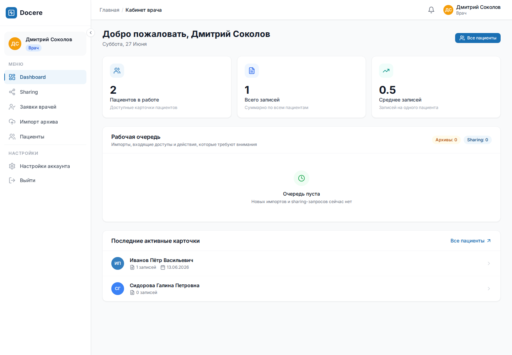
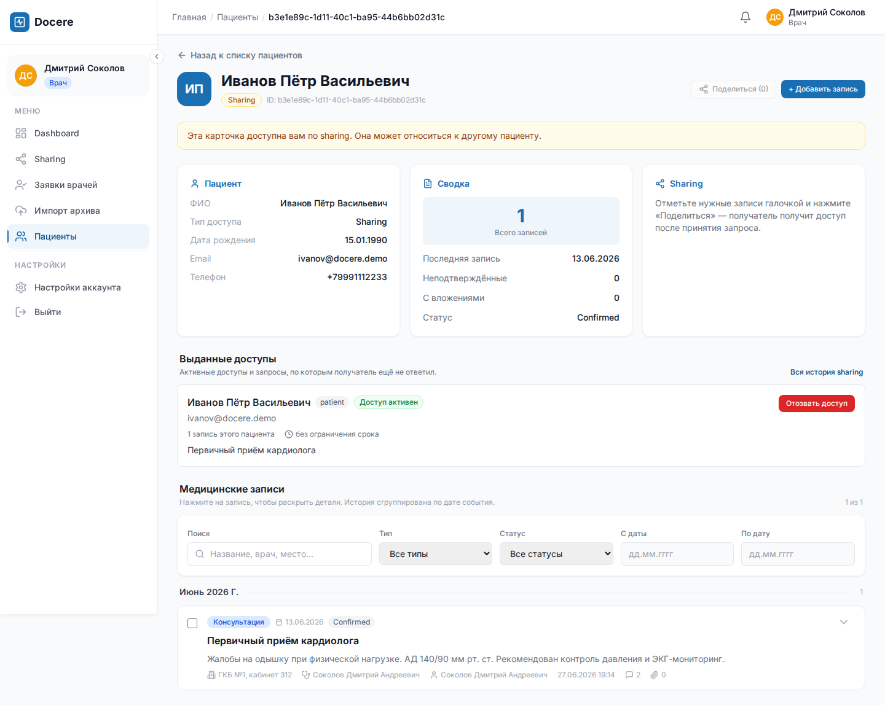
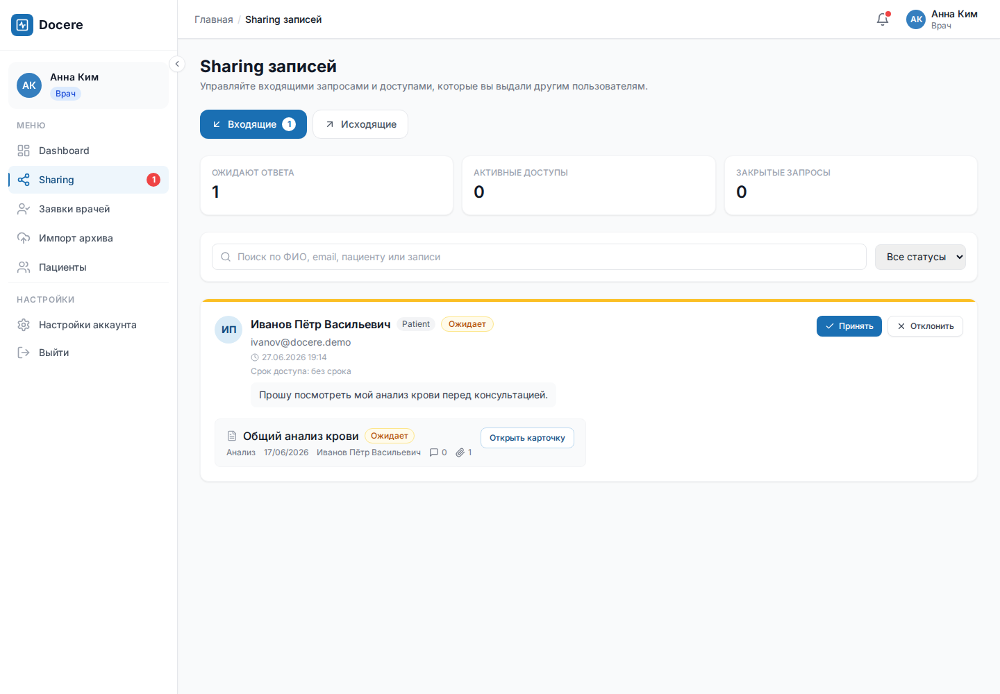
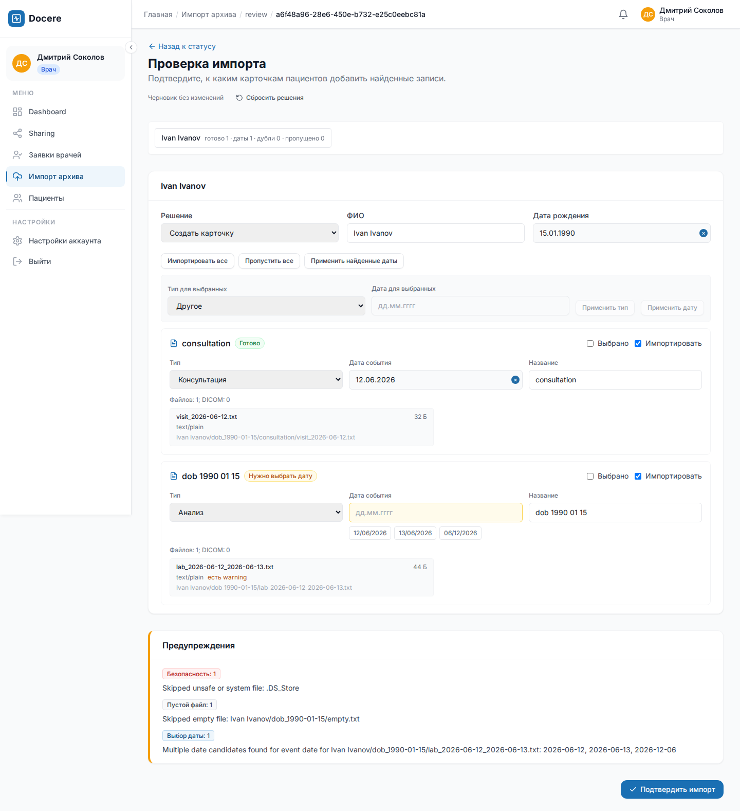

# Docere

**Docere** - система совместной работы с медицинской историей пациента. Она объединяет медицинские записи, вложения, комментарии врачей, передачу доступа и импорт архивов в один управляемый процесс.

Вместо безусловной загрузки файлов Docere сначала строит черновик импорта, показывает найденных пациентов и группы записей, подсвечивает неоднозначные даты и только после проверки пользователя изменяет медицинскую историю.

[Возможности](#возможности) · [Демонстрация](docs/DEMO.md) · [Быстрый старт](#быстрый-старт) · [Архитектура](ARCHITECTURE.md) · [Разработка](CONTRIBUTING.md)



## Задача продукта

Медицинские документы редко существуют в одном месте и одном формате. Пациент приносит результаты из разных клиник, врач получает PDF, изображения и DICOM-исследования, а доступ к данным передаётся через мессенджеры и почту без понятного жизненного цикла.

Docere закрывает этот разрыв:

- формирует единую временную шкалу медицинской истории;
- отделяет личность пациента от конкретной учётной записи и поддерживает черновые карточки;
- фиксирует автора, статус подтверждения и происхождение доступа к каждой записи;
- позволяет делиться отдельными записями, а не всей медицинской картой;
- даёт получателю принять или отклонить доступ, отправителю - отменить или отозвать его;
- каскадно отзывает последующие передачи, если промежуточный пользователь потерял право доступа;
- разбирает ZIP и DICOM в фоне, но оставляет финальное решение человеку;
- сохраняет значимые действия в аудите для администратора.

## Роли

| Роль | Основные задачи |
|---|---|
| Пациент | Ведёт свою историю, загружает документы, принимает доступы, подаёт заявку на роль врача |
| Врач | Работает с доступными пациентами, создаёт записи, комментирует, импортирует архивы и делится результатами |
| Администратор | Управляет пользователями, видит операционный dashboard и журнал аудита, подтверждает заявки врачей |

Роль врача нельзя получить простой сменой поля профиля. Пациент выбирает проверяющих и указывает специализацию. Заявку одобряет либо администратор, либо два разных подтверждённых врача той же специализации.

## Возможности

### Медицинская карта как временная шкала

Карточка пациента объединяет консультации, обследования, лабораторные результаты и произвольные документы. Записи фильтруются по типу, статусу и диапазону дат; рядом доступны вложения, врач-автор, место приёма и профессиональные комментарии.



Ключевые правила:

- пациент видит собственную карту и явно переданные ему записи;
- врач видит только карточки, к которым получил доступ или которые создал сам;
- запись хранит дату медицинского события отдельно от технической даты создания;
- неподтверждённая запись остаётся видимой как отдельное состояние, а подтверждение фиксирует пользователя и время;
- комментарии к медицинским записям оставляют врачи и администраторы с действующим доступом.

### Sharing с управляемым жизненным циклом

Отправитель выбирает конкретные записи, получателя и при необходимости срок действия. Получатель видит контекст запроса до принятия: пациента, название, тип, дату, количество вложений и комментариев.



Состояния sharing-запроса: `pending`, `accepted`, `declined`, `cancelled`, `revoked`. Повторная отправка записи пользователю с уже действующим доступом пропускается как дубликат.

Отзыв учитывает цепочки повторной передачи. Если A поделился записью с B, а B с C, отзыв A -> B отзовёт и B -> C. Если у B есть другое независимое право на эту запись, каскад не продолжится и легитимный доступ сохранится.

### Архив не импортируется вслепую

Загрузка архива создаёт фоновое задание. После безопасного чтения ZIP система формирует review-черновик:

- предлагает совпадения с существующими пациентами;
- группирует DICOM сначала по `StudyInstanceUID`, затем по `SeriesInstanceUID`;
- извлекает дату рождения только из `PatientBirthDate` или явно размеченного контекста `dob` / `birth` / `дата рождения`;
- предлагает пользователю выбрать дату медицинского события, если найдено несколько кандидатов;
- показывает потенциальные дубликаты до создания записей;
- позволяет импортировать или пропустить отдельные группы и применить массовые решения;
- сохраняет промежуточный review-черновик.



Подозрительные пути, системный мусор, пустые файлы, слишком большие элементы и аномальная степень сжатия пропускаются с предупреждением. Битый архив переводит задание в понятный статус ошибки, не раскрывая пользователю низкоуровневое исключение.

### Доверие и аудит

Администратор видит изменения статусов пользователей и значимые действия системы. Изменение ФИО или специализации подтверждённого врача разрешено, но сохраняется как audit event с предыдущим и новым значением.

Отдельно аудируются создание и обработка sharing-запросов, действия с медицинскими записями и явное разрешение импорта потенциального дубликата.

## Демонстрационный сценарий

Команда `seed-demo` создаёт связанный набор данных: пациентов, врачей, медицинские записи, вложения, комментарии, принятый и ожидающий sharing-запрос.

| Пользователь | Email | Что посмотреть |
|---|---|---|
| Администратор | `admin@docere.demo` | Dashboard, пользователи, аудит |
| Кардиолог | `dr.sokolov@docere.demo` | Пациенты, карточка Иванова, выданный доступ |
| Невролог | `dr.kim@docere.demo` | Входящий sharing-запрос от пациента |
| Пациент | `ivanov@docere.demo` | Собственная история и активный доступ от врача |
| Пациент | `petrova@docere.demo` | Неподтверждённая запись |

Пароль всех демо-учёток: `DemoPass123`.

> `seed-demo` идемпотентен, но перед заполнением очищает прикладные таблицы. Используйте его только в локальном или демонстрационном окружении.

## Быстрый старт

Требование для полного запуска: Docker Desktop с WSL integration. Node.js 22 и npm нужны только для отдельной
frontend-разработки.

```bash
docker compose up -d --build
docker compose run --rm api migrate
docker compose run --rm -v "$(pwd):/demo" api seed-demo --archive-output /demo/docere-demo-archive.zip
```

После запуска:

- приложение: [http://localhost:8000](http://localhost:8000)
- OpenAPI: [http://localhost:8000/docs](http://localhost:8000/docs)
- MinIO console: [http://localhost:9001](http://localhost:9001)

Для основного демонстрационного сценария войдите как `dr.sokolov@docere.demo`, загрузите созданный
`docere-demo-archive.zip` и откройте review. Архив содержит только синтетические данные: совпадение с существующим
пациентом, новую карточку, DICOM-группу, неоднозначную дату, потенциальный дубль и небезопасный ZIP-путь.

Для frontend-разработки с hot reload запустите `cd frontend && npm install && npm run dev`; Vite откроется на
[http://localhost:5173](http://localhost:5173) и будет проксировать API через gateway.

Проверить окружение:

```bash
docker compose ps
curl http://localhost:8000/api/health
```

## Что находится внутри

- FastAPI API с typed application DTO и отдельными HTTP-схемами;
- PostgreSQL и миграции Alembic;
- S3-compatible storage на MinIO для архивов и вложений;
- Celery + Redis для фонового разбора архивов;
- React, TypeScript, Vite и Zustand на frontend;
- JWT access/refresh tokens, PBKDF2, RBAC и аудит;
- структурированные логи, `request_id`, health checks и graceful shutdown;
- архитектурные тесты, запрещающие зависимость внутренних слоёв от infrastructure.

Подробное устройство, диаграммы потоков, инварианты, принятые компромиссы и правила расширения описаны в [ARCHITECTURE.md](ARCHITECTURE.md).

## Проверки

```bash
make project-check
```

Команда запускает проверку форматирования, `ruff`, строгую типизацию `mypy`, backend-тесты и pre-commit hooks. Frontend проверяется отдельно:

```bash
cd frontend
npm run build
npm run lint
```

Процесс разработки, формат commit message и требования к Merge Request находятся в [CONTRIBUTING.md](CONTRIBUTING.md).
