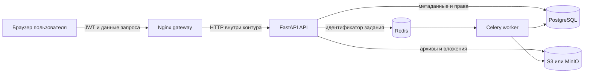

# Модель безопасности Docere

Этот документ описывает активы, границы доверия, реализованные меры защиты и остаточные риски Docere. Он нужен для проверки архитектурных решений и подготовки дипломной работы. Docere остаётся учебным прототипом и не заявляется как аттестованная медицинская информационная система.

## Область защиты

Docere обрабатывает следующие категории данных:

- учётные данные и профиль пользователя;
- карточки пациентов и медицинские записи;
- вложения, ZIP-архивы и DICOM-метаданные;
- решения о передаче и отзыве доступа;
- заявки на роль врача;
- события аудита и технические журналы.

Критические свойства системы:

- **конфиденциальность** — запись и файл доступны только пользователю с действующим основанием доступа;
- **целостность** — изменение записи, роли или права выполняется только разрешённым сценарием;
- **прослеживаемость** — для значимых действий сохраняются автор, объект, действие и время;
- **доступность** — сбой импорта или отдельного файла не должен блокировать основное API и повреждать историю;
- **объяснимость** — автоматический разбор архива предлагает решения, а итоговое изменение истории подтверждает пользователь.

## Границы доверия



Браузер, загружаемые файлы и входные HTTP-данные считаются недоверенными. PostgreSQL, Redis и S3 должны быть доступны только внутри инфраструктурного контура. Локальный `docker-compose.yml` использует демонстрационные пароли и HTTP; эти значения и топология не подходят для публичного размещения.

## Аутентификация

- Пароль при регистрации имеет длину от 8 до 128 символов.
- Пароли хешируются `PBKDF2-HMAC-SHA256` с индивидуальной случайной солью и 600 000 итераций.
- Сравнение хешей выполняется через `hmac.compare_digest`.
- API выпускает разные JWT типов `access` и `refresh` и проверяет тип токена при декодировании.
- Алгоритм проверки задаётся конфигурацией и передаётся в `jwt.decode` как явный список разрешённых алгоритмов.
- Access token по умолчанию действует 60 минут, refresh token — 7 суток.
- После декодирования токена пользователь повторно загружается из БД. Заблокированная или отсутствующая учётная запись не получает доступ только на основании корректной подписи JWT.
- Регистрация и вход ограничены локальным rate limiter: не более пяти попыток на ключ за 60 секунд.

Текущая модель JWT не хранит серверный реестр сессий. Блокировка пользователя закрывает новые авторизованные запросы через проверку состояния учётной записи. Смена пароля не отзывает уже выпущенные токены, выборочный немедленный отзыв отдельного refresh token также не реализован.

## Авторизация и роли

Поддерживаются роли пациента, врача и администратора. Проверка роли дополняется проверкой доступа к конкретной медицинской записи.

Центральное правило — право хранит происхождение:

```text
UserRecordLink
├── user_id
├── record_id
├── source
├── source_record_share_id
└── expires_at
```

Это позволяет:

- отличить право создателя от принятой передачи;
- удалить право, созданное конкретным sharing-запросом;
- сохранить независимое право на ту же запись;
- исключить истёкшее право во время чтения;
- каскадно отозвать зависимую ветвь повторных передач.

Файлы скачиваются через авторизованный use case. Наличие `storage_key` само по себе не даёт право получить объект из S3.

Роль врача назначается после решения администратора либо кворума двух разных подтверждённых врачей той же специализации. Повторное решение проверяющего и изменение финальной заявки запрещены.

## Безопасность архивов и файлов

ZIP-архив читается в памяти без распаковки путей в файловую систему. Адаптер:

- отклоняет абсолютные пути, Windows drive paths, `..` и `.` в сегментах;
- нормализует обратные слеши;
- пропускает системный мусор и пустые файлы;
- ограничивает архив 1000 файлами;
- ограничивает один файл 100 МиБ;
- ограничивает суммарный несжатый размер 500 МиБ;
- отклоняет элемент с коэффициентом сжатия выше 100;
- завершает задание понятной ошибкой при повреждённом ZIP;
- формирует review-черновик до изменения медицинской истории.

DICOM используется для чтения метаданных и группировки исследований. Загружаемые данные не должны передаваться внешним сервисам анализа без отдельного решения владельца данных.

## Аудит и технические журналы

Аудируются вход пользователя, изменение профиля и статуса, создание и подтверждение записей, обработка заявок врача, sharing и импорт. Просмотр журнала разрешён администратору.

Каждый HTTP-запрос получает `X-Request-ID`. Структурированный лог содержит метод, путь, статус и длительность. Импорт дополнительно пишет идентификатор задания, длительность, количество файлов, предупреждений и итоговый статус.

Технические журналы не должны содержать:

- пароли и JWT;
- секреты подключения;
- содержимое медицинских документов;
- персональные данные, не необходимые для диагностики;
- бинарное содержимое архивов и вложений.

## Секреты и конфигурация

- Production-секреты передаются через переменные окружения и не хранятся в Git.
- `SecretStr` скрывает секрет подписи JWT и ключ S3 при стандартном представлении настроек.
- Локальные значения `dev-secret-key`, `docere` и `minioadmin` предназначены только для Docker-окружения разработчика.
- Публичное размещение требует TLS перед gateway, непредсказуемых отдельных секретов, сетевого ограничения PostgreSQL, Redis и S3 и запрета публикации административных интерфейсов.
- Образы для воспроизводимого релиза следует фиксировать тегом версии и digest вместо `latest`.

## Модель угроз

| Угроза | Реализованные меры | Остаточный риск и следующий шаг |
|---|---|---|
| Подбор пароля | PBKDF2, минимальная длина, rate limit | Перенести limiter в Redis, добавить MFA и блокировку по совокупности сигналов |
| Кража токена | Подпись, срок действия, разделение access/refresh, проверка пользователя в БД | Добавить серверный реестр сессий, rotation и выборочный отзыв refresh token |
| Доступ к чужой записи | Роль и record-level access link с происхождением | Расширять отрицательные тесты при каждом новом endpoint |
| Некорректный каскадный отзыв | Точечное удаление link и сохранение независимого основания | Поддерживать тесты цепочек и циклов передачи |
| ZIP Slip и архивная бомба | Нормализация пути, лимиты размера, количества и сжатия | Добавить лимит времени и памяти worker на уровне контейнера |
| Несанкционированное скачивание S3 | Объект выдаётся через авторизованный use case | Закрыть прямой сетевой доступ к bucket, применять отдельные production credentials |
| Утечка через логи | Структурированные события с техническими полями | Ввести автоматическую проверку и срок хранения журналов |
| Уязвимая зависимость | Lock-файлы, Dependabot, тестовый gate | Регулярно обновлять зависимости и фиксировать результат анализа |
| Потеря согласованности БД и S3 | Метаданные и storage key, транзакционные сценарии | Внедрить согласованную резервную копию и ежемесячное тестовое восстановление |
| Повторное выполнение фонового задания | Восстановление незавершённых jobs и идемпотентный resolve | При росте нагрузки добавить transactional outbox и broker confirms |
| Доступ к уже скачанному файлу после отзыва | Новое скачивание запрещается после потери права | Клиентская копия не может быть отозвана; это ограничение нужно отражать пользователю и в правилах эксплуатации |

## Проверка мер защиты

Основные автоматизированные проверки находятся в `tests/critical` и включают:

- регистрацию, вход, refresh и смену пароля;
- блокировку пользователя и проверку ролей;
- доступ к медицинской карте и вложениям;
- lifecycle sharing и каскадный отзыв;
- сохранение независимого источника доступа;
- обработку истёкшего права;
- опасные пути, пустые файлы, лимиты и повреждённые ZIP;
- DICOM-группировку и неоднозначные даты;
- идемпотентность применения решений импорта;
- запрет зависимостей между внутренними архитектурными слоями.

Локальный gate:

```bash
make project-check
cd frontend && npm run build && npm run lint && npm run test
```

## Эксплуатационные процедуры

Для среды с постоянными данными должны быть назначены владельцы следующих процедур:

1. ежедневная согласованная копия PostgreSQL и S3;
2. ежемесячное восстановление в изолированном окружении;
3. журнал инцидентов без медицинских данных и секретов;
4. проверка зависимостей и прав доступа перед релизом;
5. фиксация commit SHA, версии миграции и digest образов;
6. утверждённые сроки хранения архивов, вложений, аудита и резервных копий;
7. процедура завершения эксплуатации и удаления данных.

Целевые RPO не более 24 часов и RTO не более 240 минут являются проектными целями. Они не считаются достигнутыми до успешного восстановления с замером времени и проверкой целостности БД, S3, ролей и прав.

## Ограничения учебного прототипа

До обработки реальных медицинских данных требуются независимая проверка безопасности, правовая оценка, TLS, управление секретами, изолированная production-инфраструктура, резервное копирование, мониторинг, управление инцидентами, политика хранения и подтверждённые нагрузочные испытания. Наличие этого документа не является сертификацией или разрешением на эксплуатацию.
